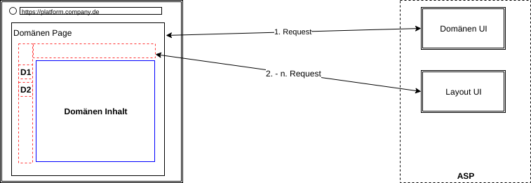
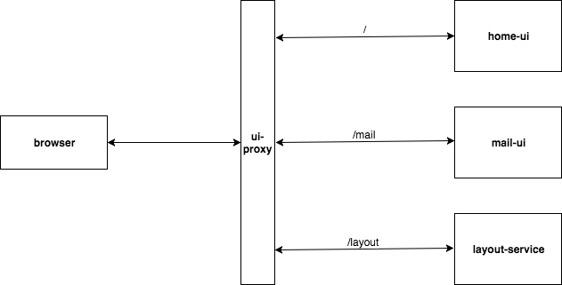

## Demo application
The application use webcomponents ([Custom Elements](https://developers.google.com/web/fundamentals/getting-started/primers/customelements) + [HTML Imports](https://www.html5rocks.com/en/tutorials/webcomponents/imports/)) to compose pages out of main (domain) content and different distributed fragments (header, footer) on the client (browser).  
The different domain pages are connected through simple hyperlinks.

NOTE: The application is functional in all major browser (pollyfills). Nevertheless there is a short flickering of the transcluded fragments (header, footer) after a GET request in browsers other then chrome (native webcomponents implementation).  
If it is not possible to work around this flickering, it should be discussed if webcomponents are the right approach for transclusion (at least for the common fragments that are visible across domain pages in the same place).  
 

 

  
 
 

## Structure
*   `ui-proxy` acts as reverse proxy and route requests depending on the context path to the correct service (using container linking).
*   `layout-service` delivers common fragments (header, footer), global styles and custom webcomponents.
*   `home-ui` delivers the 'home' domain page (static HTML).
*   `mail-ui` delivers the 'mail' domain page (ember.js).
*   `presentation` contains the dev-talk presentation ([Slides](presentation/frontend-integration.pdf)).
 

 

  
 
 

## Run the demo application
**Requirements:**  
Local docker(-compose) installation   

`docker-compose up`  

The application is then accessible under [http://localhost](http://localhost).  
 
 

## Run the presentation
**Requirements:**  
Local npm installation  

`cd presentation/`  
`npm install`  
`npm start`  

The presentation is then accessible under [http://localhost:8000](http://localhost:8000).  
NOTE: You can view the presentation notes by hitting `s` in the browser.  
 
 

## Resources
### Microservice/SCS UI composition
*   [Self contained systems](http://scs-architecture.org/)
*   [Blog: Micro-Services and Page Composition Problem](https://dejanglozic.com/2014/10/20/micro-services-and-page-composition-problem/)
*   [Blog: Components Are (Still) Hard on the Web](https://dejanglozic.com/2016/10/31/components-are-still-hard-on-the-web/)
*   [Blog: Micro Service Composition](https://medium.com/@clifcunn/nodeconf-eu-29dd3ed500ec)
*   [Blog: ROCA vs. SPA](https://www.innoq.com/de/blog/lvm-roca-vs-spa/)
*   [Blog: Transclusion](https://www.innoq.com/de/blog/transclusion/)
*   [Talk: Wait, what? Our microservices have actual human users? (Stefan Tilkov)](https://www.youtube.com/watch?v=jJxmi8nrHwg)
*   [Talk: An Unexpected Solution To Microservices UI Composition (autoscout/thoughtworks)](https://www.youtube.com/watch?v=j0hWd5ct5wY)

### Tech
*   [Webcomponents](https://www.webcomponents.org/introduction)
*   [Webcomponents Polyfills](https://github.com/webcomponents/webcomponentsjs)
*   [Compoxure](https://github.com/tes/compoxure)
*   [Mosaic](https://www.mosaic9.org/)
*   [Ember Engines](https://ember-engines.com/)
